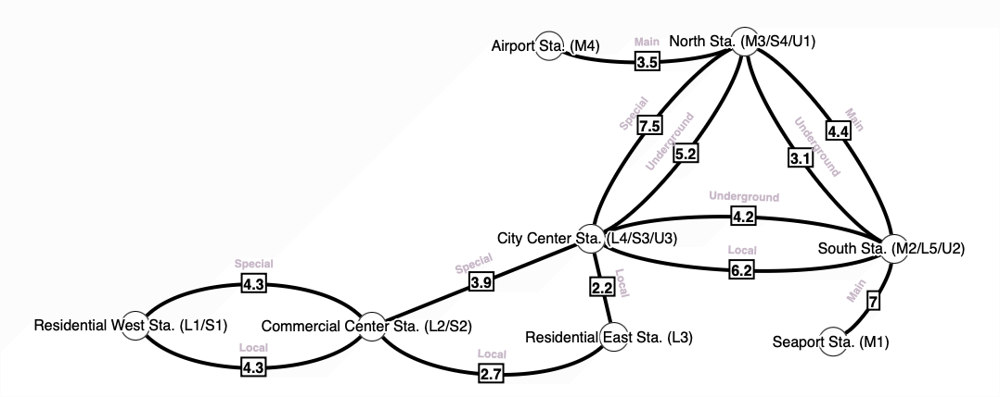

# Railway Multigraphs

### Introduction

In this project, I use multigraphs and variations of Dijkstra's Shortest Path to model passenger rail networks. In addition to using the standard version of Dijkstra's Algorithm that finds the shortest path by distance, I created a modified version that finds the _cheapest_ path, considering multiple railway operators and transfers between them.

### Data Structure: Multigraph

A multigraph is a graph that can have parallel edges, or in other words, multiple edges that connect the same two nodes. These are the main abstract considerations I had in applying it to passenger rail networks:

- **Parallel edges** (use a multigraph instead of a graph): Different rail lines can connect the same two stations.
- **All weighted edges**: The distance traversed between stations is fundamental to creating an itinerary.
- **All undirected edges**: While single-direction railways may exist somewhere, I'm assuming there will always be service in both directions in this project.
- **No self-loops**: It wouldn't make sense to leave and come back to the same station without going to any other stations.
- **Cyclic**: There can be circle routes or other cycles achievable through transfers.

### Algorithm: Dijkstra's Shortest Path

Dijkstra's shortest path finds the shortest path from a starting node to all other nodes, or to a specific destination node, as I implement here. In other words, considering the weights of the edges, it finds which path would result in the minimum sum of edge weights. I have both a distance version, where edge weights are fixed, and a cost version, where edge weights are dynamic and depend on the fare structures of the rail lines and transfers between them.

### Building, Testing, and Running the Project

The project requires a C++23 compiler such as GCC 14+ or Clang 18+ (tested with GCC 14 and 15) and CMake 3.25+. The project also uses GoogleTest as a Git submodule.

Using the command runner [just](https://github.com/casey/just):

```bash
just rebuild
just test
just run
```

Or running the same commands manually:

```bash
rm -rf build
cmake -B build -DCMAKE_BUILD_TYPE=Release
cmake --build build
ctest --test-dir build --output-on-failure --verbose
./build/railway-multigraphs
```

### Toy Data Example Visualization

Here is one example of the visualizations I made using [graphonline.top](https://graphonline.top). The other toy data images can be found in [the `toy_data_viz` subdirectory](toy_data_viz/) along with `.graphml` files that can be opened and edited on the website.



### Terminal Output

Here is the terminal output printed when running the main executable:

```
--------------------

Here is your route from Station A to Station C:

  Start: Station A
  -> Go to Station B via the ABCD Line
  -> Go to Station D via the ABCD Line
  -> Go to Station C via the ABCD Line

  Total distance: 6.0 mi

--------------------


--------------------

Here is your route from Park Station to Airport Station:

  Start: Park Station
  -> Go to West Residential Station via the Tiny City Railway
  -> Go to Hospital Station via the Tiny City Railway
  -> Go to City Hall Station via the Tiny City Railway
  -> Go to Airport Station via the Tiny City Railway

  Total distance: 16.0 mi

--------------------


--------------------

Here is your route from Station A to Station F:

  Start: Station A
  -> Go to Station B via the Savings Line
  -> Go to Station D via the Express Line
  -> Go to Station E via the Express Line
  -> Go to Station F via the Savings Line

  Total distance: 6.0 mi
  Total cost: $5.18

--------------------


--------------------

Here is your route from Station A to Station F:

  Start: Station A
  -> Go to Station B via the Savings Line
  -> Go to Station C via the Savings Line
  -> Go to Station D via the Savings Line
  -> Go to Station E via the Savings Line
  -> Go to Station F via the Savings Line

  Total distance: 13.7 mi
  Total cost: $2.40

--------------------


--------------------

Here is your route from Seaport Station to City Center Station:

  Start: Seaport Station
  -> Go to South Station via the Main Line
  -> Go to City Center Station via the Underground Loop

  Total distance: 11.2 mi
  Total cost: $6.47

--------------------


--------------------

Here is your route from Seaport Station to City Center Station:

  Start: Seaport Station
  -> Go to South Station via the Main Line
  -> Go to City Center Station via the Commuter Local

  Total distance: 13.2 mi
  Total cost: $5.74

--------------------


--------------------

Here is your route from South Station to Airport Station:

  Start: South Station
  -> Go to North Station via the Underground Loop
  -> Go to Airport Station via the Main Line

  Total distance: 6.6 mi
  Total cost: $5.22

--------------------


--------------------

Here is your route from South Station to Airport Station:

  Start: South Station
  -> Go to North Station via the Main Line
  -> Go to Airport Station via the Main Line

  Total distance: 7.9 mi
  Total cost: $3.48

--------------------


--------------------

Here is your route from Residential West Station to North Station:

  Start: Residential West Station
  -> Go to Commercial Center Station via the Commuter Special
  -> Go to City Center Station via the Commuter Special
  -> Go to North Station via the Underground Loop

  Total distance: 13.4 mi
  Total cost: $8.03

--------------------


--------------------

Here is your route from Residential West Station to North Station:

  Start: Residential West Station
  -> Go to Commercial Center Station via the Commuter Local
  -> Go to Residential East Station via the Commuter Local
  -> Go to City Center Station via the Commuter Local
  -> Go to North Station via the Underground Loop

  Total distance: 14.4 mi
  Total cost: $6.66

--------------------
```
